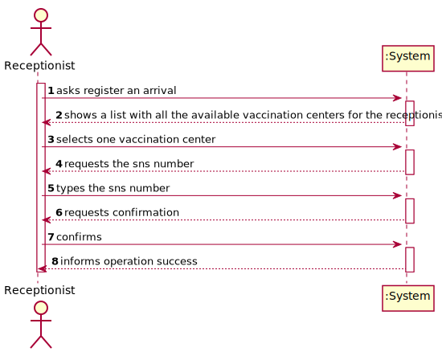
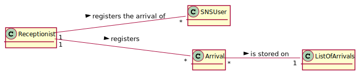
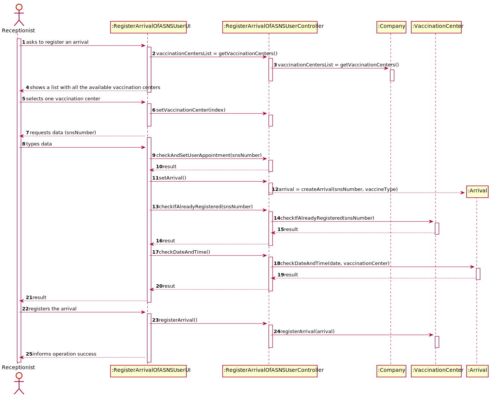
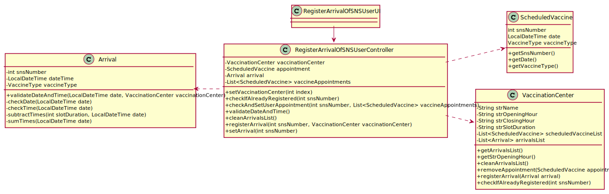

# US 006 - To register the arrival of an SNS user

## 1. Requirements Engineering

### 1.1. User Story Description

As a receptionist, I want to register the arrival of an SNS user so that the SNS user can take the vaccine.

### 1.2. Customer Specifications and Clarifications 

**From the specifications document:**

>	The receptionist asks the SNS user for his/her SNS user number and
confirms that he/she has the vaccine scheduled for the that day and time. If the information is
correct, the receptionist acknowledges the system that the user is ready to take the vaccine.

**From the client clarifications:**

In this user story, the receptionist registers the arrival of an SNS User. Does the receptionist choose the center she works at during login like the nurse?

> **Question:** In this user story, the receptionist registers the arrival of an SNS User. Does the receptionist choose the center she works at during login like the nurse?
>  
> **Answer:** To start using the application, the receptionist should first select the vaccination center where she is working. The receptionists register the arrival of an SNS user at the vaccination center where she is working.

> **Question:** The nurse  must have the possibility to choose which center she wants to register the SNS user's arrival every time she uses this feature, or should we make the nurse pick a center after they log in?
>
> **Answer:** To start using the application, the nurse should first select the vaccination center where she is working.

> **Question:** When the receptionist registers a SNSUser arrival, should we validate that the vaccination center where the SNS user arrives is the same as where the receptionist is currently working? If so, should we allocate receptionists to vaccination centers, i.e., ask the receptionist which vaccination center is she currently working at?
>
> **Answer:** To start using the application, the receptionist should first select the vaccination center where she is working. The receptionists register the arrival of an SNS user at the vaccination center where she is working.

> **Question:** Regarding US04, what are the attributes needed in order to register the arrival of an SNS user to a vaccination center.
> 
> **Answer:** The time of arrival should be registered.

> **Question:** Regarding US04, a receptionist register the arrival of an SNS user immediately when he arrives at the vaccination center or only after the receptionist confirms that the respective user has a vaccine schedule for that day and time.
>
> **Answer:** The receptionist registers the arrival of an SNS user only after confirming that the user has a vaccine scheduled for that day and time.

> **Question:** When the SNS user number is introduce by the receptionist and the system has no appointment for that SNS user number, how should the system proceed?
>
> **Answer:** The application should present a message saying that the SNS user did not schedule a vaccination.

> **Question:** Regarding US04, I would like to know what's the capacity of the waiting room.
>
> **Answer:** The waiting room will not be registered or defined in the system. The waiting room of each vaccination center has the capacity to receive all users who take the vaccine on given slot.

> **Question:** Respectively to US04, after the receptionist registers the SNS User's arrival at the Vaccination Center, the system creates the list that will be available for the Nurse to view, correct?
>
> **Answer:** The nurse checks the list (of SNS users in the waiting room) in US05.

### 1.3. Acceptance Criteria

* **AC1:** No duplicate entries should be possible for the same SNS user on the same day or vaccine period.

### 1.4. Found out Dependencies

* There is a dependency to "US001 and US002 schedule a vaccination" since in order to an SNS user go to a vaccination center
he/she needs to have a vaccination appointment.

### 1.5 Input and Output Data

**Input Data:**

* Typed data:
    * SNS number
    * Vaccination center where the receptionist is located
    * Vaccination center where the user has the appointment
    

**Output Data:**

* (In)Success of the operation

### 1.6. System Sequence Diagram (SSD)

### 1.7 Other Relevant Remarks

* No other relevant remarks

## 2. OO Analysis

### 2.1. Relevant Domain Model Excerpt

### 2.2. Other Remarks

No other remarks

## 3. Design - User Story Realization 

### 3.1. Rationale

| Interaction ID | Which class responsible for...                                                | Answer                             | Justification                                                                                                                                                                         |
|:---------------|:------------------------------------------------------------------------------|:-----------------------------------|:--------------------------------------------------------------------------------------------------------------------------------------------------------------------------------------|
| Step 1         | ...showing the list with all the Vaccination Centers available                | RegisterArrivalOfSNSUserUI         | **Pure Fabrication**: there is no reason to assign this responsibility to any existing class in the Domain Model.                                                                     |
 |                | ...disponibilize the previous list to the RegisterArrivalOfSNSUserUI          | RegisterArrivalOfSNSUserController | **Controller:** act as a mediator between the UI and the Model. Has the responsibility of controlling the data transmission between both. It maps the user action into model updates. |   
 |                | ... disponibilize the previous list to the RegisterArrivalOfSNSUserController | Company                            | **IE:** The Company knows all of it's Vaccination Centers.                                                                                                                            |
|                | ...saving the selected Vaccination Center                                     | RegisterArrivalOfSNSUserController | **IE:** the controller needs to know the selected Vaccination Center throughout the whole process of registering a arrival                                                            |
 | Step 2         | ...request the sns number                                                     | RegisterArrivalOfSNSUserUI         | **Pure Fabrication**: there is no reason to assign this responsibility to any existing class in the Domain Model.                                                                     |
| Step 4         | ...check the requirements for registration                                    | RegisterArrivalOfSNSUserController | **Validation**                                                                                                                                                                        | 
|                | ...validate Date and Time                                                     | Arrival                            | The class Arrival knows the date and time of the arrival, therefore it can check whether or not the user has arried on the right time                                                 |
|                | ...check if an User is already registered                                     | VaccinationCenter                  | The class VaccinationCenter knows all the arrivals, so it can check whether or not a user has already been registered                                                                 | 
|                | ...get user's appointment                                                     | RegisterArrivalOfSNSUserController | The class RegisterArrivalOfSNSUserController has to know the appointment of the user therefore it can check whether or not the appointment is valid                                   |
| Step 5         | ...register the arrival of an SNS user                                        | VaccinationCenter                  | **Registration**                                                                                                                                                                      |
|                | ...saving the inputted data of the arrival                                    | VaccinationCenter                  | IE: Company stores everything                                                                                                                                                         |
| Step 6         | ...informing operation success                                                | RegisterArrivalOfSNSUserUI         | IE: is responsible for user interactions                                                                                                                                              |

### Systematization ##

According to the taken rationale, the conceptual classes promoted to software classes are: 

 * VaccinationCenter
 * Arrival
 
Other software classes (i.e. Pure Fabrication) identified: 

 * CreateTaskUI  
 * CreateTaskController
 * Company

## 3.2. Sequence Diagram (SD)

## 3.3. Class Diagram (CD)

