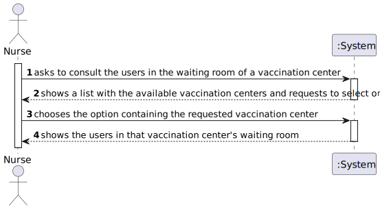
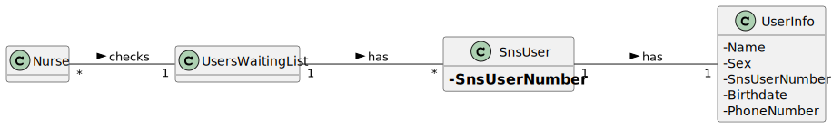
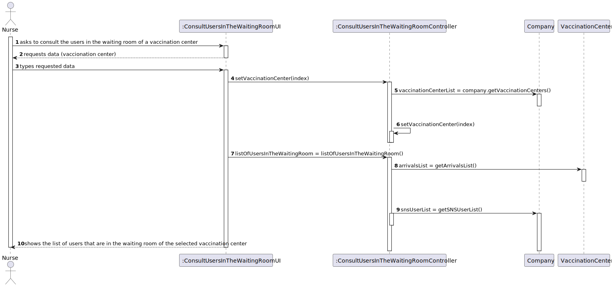
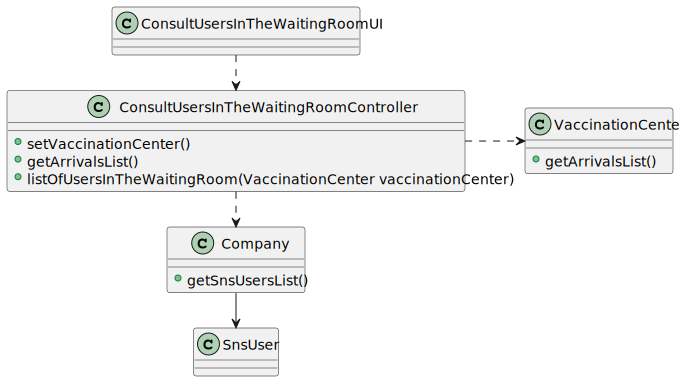

# US 005 - Consult the users in the waiting room of a vaccination center. 

## 1. Requirements Engineering

### 1.1. User Story Description

>* **_As a nurse, I intend to consult the users in the waiting room of a vaccination center._**

### 1.2. Customer Specifications and Clarifications 

**From the specifications document:**

> **_"At any time, a nurse responsible for administering the vaccine will use the application to check the list of SNS users that are present in the vaccination center to take the vaccine"_**

**From the client clarifications:**

> **Question:** In the PI description it is said that, by now, the nurses and the receptionists will work at any center. Will this information remain the same on this Sprint?

> **Answer:** _Nurses and receptionists can work in any vaccination center._
 
> **Question:** What does consulting constitute in this context? Does it refer only to seeing who is present and deciding who gets the vaccine or is checking the user info to administer the vaccine, registering the process, and sending it to the recovery room also part of this US?

> **Answer:** _The goal is to check the list of users that are waiting and ready to take the vaccine._
 
> **Question:** Do we need to know if the nurse have to choose the vaccination center before executing the list or if that information comes from the employee file?
 
> **Answer:** _When the nurse starts to use the application, firstly, the nurse should select the vaccination center where she his working. The nurse wants to check the list of SNS users that are waiting in the vaccination center where she his working._
  
> **Question:** Do we need to know what is the name of the attribute that defines that the user has arrived? In the last sprint we have created the “Status” attribute, can we continue using it?
 
> **Answer:** _This is not a question for the client._
 
> **Question:** Which are the attributes of the waiting room?

> **Answer:** _The waiting room will not be registered or defined in the system. The waiting room of each vaccination center has the capacity to receive all users who take the vaccine on given slot._

> **Question:** What information about the Users (name, SNS number, etc) should the system display when listing them?

> **Answer:** _Name, Sex, Birth Date, SNS User Number and Phone Number._

> **Question:** Regarding US05, the listing is supposed to be for the day itself or for a specific day?
 
> **Answer:**  The list should show the users in the waiting room of a vaccination center.
 
> **Question:** Is it supposed to remove an SNS user of the wait list when he leaves the waiting room to get the vaccine? If yes, how do we know when  the sns user leaves the waiting room?
 
> **Answer:** US5 is only to list users that are in the waiting room of a vaccination center. In Sprint D we will introduce new user stories.

### 1.3. Acceptance Criteria

* **AC1:** SNS Users' list should be presented by order of arrival

### 1.4. Found out Dependencies

>* There is a dependency to "US004 - register the arrival of an SNS user to take the vaccine" since in order to consult the users in a waiting room of a vaccination center, they must arrive at one.

### 1.5 Input and Output Data

**Input Data:**

Selected Data:
>* Select the option containing the vaccination center the nurse belongs to.

**Output Data:**

>* A list containing the SNS Users in the waiting room of the selected vaccination center.

### 1.6. System Sequence Diagram (SSD)

**Alternative 1**

### 1.7 Other Relevant Remarks

>* The list of users in the waiting room to be presented is from the vaccination center the nurse belongs to, and sorted by order of arrival.

## 2. OO Analysis

### 2.1. Relevant Domain Model Excerpt 

### 2.2. Other Remarks

> *_There aren't any other relevant remarks._*

## 3. Design - User Story Realization 

### 3.1. Rationale

**SSD - Alternative 1 is adopted.**

| *Interaction ID* | *Question: Which class is responsible for...* | *Answer*  | *Justification (with patterns)*  |
|:-------------  |:--------------------- |:------------|:---------------------------- |
| Step 1  		 |	... interacting with the actor?	 |       ConsultUsersInTheWaitingRoomUI     |    *Pure Fabrication:* The UI class is responsible for the direct interaction with the user through the controller and the different other implemented classes. | Step 2  		 |							 |             |                              |
| |... coordinating the US? | ConsultUsersInTheWaitingRoomController| *Controller:* Intermediary between the UI and the Domain Model, and as its name says, controls the information that is transferred between both of them. |
| Step 2  		 |		... showing the list containing the created vaccination centers	 |   ConsultUsersInTheWaitingRoomUI         |      *Pure Fabrication:* The _UI_ makes the direct interaction with the application user, which allows in this case, Nurses to select the vaccination center they work at.     |
| 		 |		... taking the list to the UI	 |  ConsultUsersInTheWaitingRoomController       |     *IE:* The _Controller_ is the intermediary that takes the data to the UI.    |
| 		 |		... supplying the list to the Controller	 |  Company     |     *IE:* The class _Company_ has the Vaccination Centers and their information.   |
| 		 |		... saving the selected vaccination center	 |  ConsultUsersInTheWaitingRoomController    |     *IE:* In order to get the list of Users in the waiting room of a vaccination center, the Controller class needs to know what is the selected vaccination center.   |
| Step 3  		 |		... creating the list of users in the waiting room					 |   ConsultUsersInTheWaitingRoomController          |      *IE:* The _ConsultUsersInTheWaitingRoomController_ class is responsible for getting the information from the arrivals list, and return the list of SNSUsers that are in the waiting room.     |
| 		 |		... supplying the list of arrivals	 |  VaccinationCenter    |     *IE:* The class _VaccinationCenter_ has the list of arrivals.   |
| 		 |		... supplying the list of SNS Users	 |  Company   |     *IE:* The class _Company_ has the list of SNS Users.   |
| Step 4 		 |		... presenting the list of SNS Users in the waiting room |  ConsultUsersInTheWaitingRoomUI          |         *Pure Fabrication:* The _UI_ class presents the list created in the _Controller_.           |
### Systematization ##

According to the taken rationale, the conceptual classes promoted to software classes are: 

 * VaccinationCenter
 * Company

Other software classes (i.e. Pure Fabrication) identified: 

 * ConsultUsersInTheWaitingRoomUI  
 * ConsultUsersInTheWaitingRoomController

## 3.2. Sequence Diagram (SD)

**Alternative 1**

## 3.3. Class Diagram (CD)

**From alternative 1**

