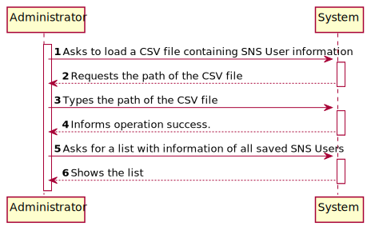
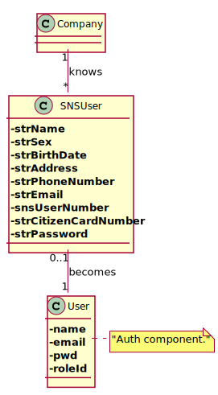
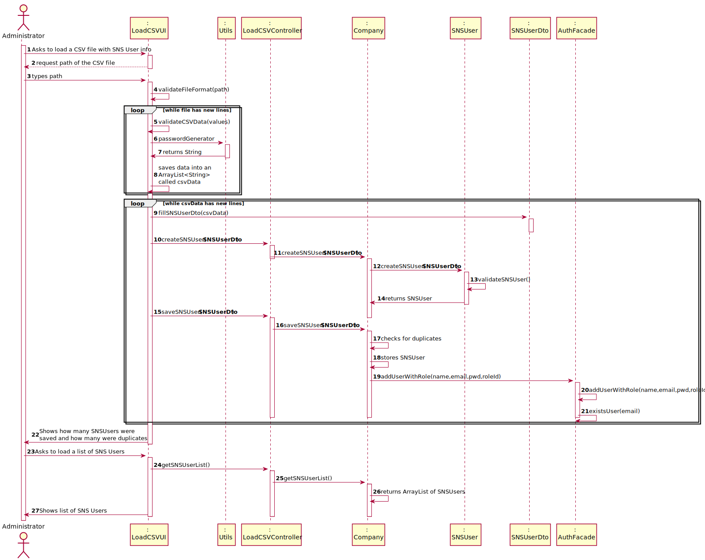
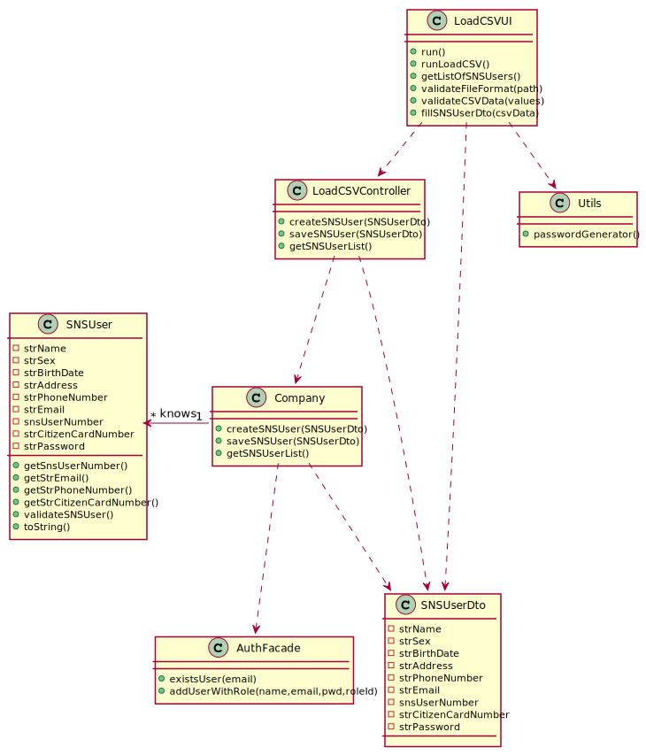

# US 014 - As an administrator, I want to load a set of users from a CSV file.

## 1. Requirements Engineering

### 1.1. User Story Description

*As an administrator, I want to load a set of users from a CSV file.*

### 1.2. Customer Specifications and Clarifications

**From the specifications document:**

>[...]The user should introduce his/her SNS user number[...]

**From the client clarifications:**

>*Question:* "What would be the sequence of parameters to be read on the CSV? For example: "Name | User Number".
>
>*Answer:* Name, Sex, Birth Date, Address, Phone Number, E-mail, SNS User Number and Citizen Card Number.

>*Question:* "how should the admin receive the login data/passwords for all registered users?"
>
>*Answer:* During this sprint, login and password data should be presented in the console application. In US14 the application is used to register a batch of users. For each user, all the data required to register a user should be presented in the console.

>*Question:* "What should the system do if the file to be loaded has information that is repeated? For example, if there are 5 lines that have the same information or that have the same attribute, like the phone number, should the whole file be discarded?"
>
>*Answer:* If the file does not have other errors, all records should be used to register users. The business rules will be used to decide if all file records will be used to register a user. For instance, if all users in the CSV file are already registered in system, the file should be processed normally but no user will be added to the system (because the users are already in the system).

>*Question:* This question also regards the attribute sex, is the format "F"/"M"/ "N/A", or "female"/"male"/"N/A" , or a different, or can it be any?
>
>*Answer:* From a previous answer we get "Optional attributes may have a NA value".

>*Question:* "is there any specific format that should be validated for the address, or we can assume it is just of string type?"
>
>*Answer:* The address contained in the CSV file is a string and should not contain commas or semicolons.

>*Question:* "Should our application detect if the CSV file to be loaded contains the header, or should we ask the user if is submitting a file with a header or not?"
>
>*Answer:* The application should automatically detect the CSV file type.

### 1.3. Acceptance Criteria

* **AC01:** The application must support importing two types of CSV files: a) one type must have a header, column separation is done using “;” character; b) the other type does not have a header, column separation is done using “,” character.
* **AC02:** Only files with valid information are accepted by the system.
* **AC03:** Users with duplicated information are ignored by the system.
* **AC04:** All the data required to register a user should be presented in the console.
* **AC05:** The SNS User must become a system user. The "auth" component available on the repository must be reused (without modifications).
* **AC06:** Birth day must have the format: DD/MM/YYYY.
* **AC07:** Sex options: Male/Female/NA or empty.
* **AC08:** All input fields are required except sex.
* **AC09:** The password should be randomly generated.
* **AC10:** The following fields must be unique for each SNS user: citizen card number, SNS number, phone number, and e-mail address.

### 1.4. Found out Dependencies

US014 has no dependencies.

### 1.5 Input and Output Data

**Input Data:** 
* Typed Data
    - CSV path

* Selected data:
    - Loading CSV File
    - List of SNS Users

**Output Data:**

* The number of Users that were created
* The number of Users saved
* The number of Users with duplicated information
* Warning about the file validity/existence
* A list of all the users saved in the system
* (In)Success of the operation

### 1.6. System Sequence Diagram (SSD)

### 1.7 Other Relevant Remarks

* There are some similarities to US 11 regarding the need (i) to generate a password.

## 2. OO Analysis

### 2.1. Relevant Domain Model Excerpt

### 2.2. Other Remarks

No remarks.

## 3. Design - User Story Realization

### 3.1. Rationale

| Interaction ID | Question: Which class is responsible for... | Answer  | Justification (with patterns)  |
|:-------------  |:--------------------- |:------------|:---------------------------- |
| Step 1  | Asking to load a CSV file?	                                                                     |  LoadCSVUI         | **Pure Fabrication:** there is no reason to assign this responsibility to any existing class in the Domain Model.                                                                                                        |
| Step 2  |	Requesting the path of the CSV File?	                                                         |  LoadCSVUI         | **IE:** is responsible for user interactions                                                                                                                                                                             |
| Step 3  |	Typing the path of the CSV File?	                                                             |  LoadCSVUI         | **Pure Fabrication:** there is no reason to assign this responsibility to any existing class in the Domain Model.                                                                                                        |
| 		  |  ... validating the path?                                                                        |  LoadCSVUI         | **IE:** The UI knows the path, therefore it can validate it easily.                                                                                                                                                      | 
| 		  |  ... validating the CSV that has SNS User data?                                                  |  LoadCSVUI         | **IE:** The UI knows the data inside the CSV, so it can validate the entire file.                                                                                                                                        |
| 		  |  ... generating a password for the SNS User?                                                     |  Utils             | **Pure Fabrication:** This password generator was needed for US11, so in order to avoid code duplication we are assigning it to a shared class.                                                                          |
| 		  |  ... saving the data into an ArrayList?                                                          |  LoadCSVUI         | **IE:** The UI knows the CSV data so it can save that data on an ArrayList.                                                                                                                                              |
| 		  |  ... filling the SNSUserDTO with SNS User data?                                                  |  LoadCSVUI         | **IE:** The UI knows the data inside the ArrayList so it can fill the DTO with that data.                                                                                                                                |
| 		  |  ... transferring the SNS User data from the UI to the controller?	                             |  SNSUserDTO        | **DTO:** When there is so much data to transfer, it is better to opt by using a DTO in order to reduce coupling between UI and other classes.                                                                            |
| 		  |  ... transfer the SNS User data from the controller to the company?                              |  LoadCSVController | **Controller:** act as a mediator between the UI and the Model, in this case the Company class. Has the responsibility of controlling the data transmission between both. It maps the user action into model updates.    |
| 		  |  ... instantiating a new SNS User?	                                                             |  Company           | By applying the **Creator** pattern instances of Company have the initializing information for instances of SNSUser and pass it on creation.                                                                             |
| 		  |  ... validating the SNS User?                                                                    |  SNSUser           | **IE:** The SNS User class has it's own information so it can validate itself.                                                                                                                                           |
| 		  |  ... validating SNS User duplication? 	                                                         |  Company           | **IE:** The Company class knows all SNSUsers so it can check for duplicates.                                                                                                                                             | 
| 		  |  ... saving the SNS User?                                                                        |  Company           | **IE:** The Company class has all needed SNSUser information so it can save them.                                                                                                                                        |
| 		  |  ... registering the SNS User as a system user?                                                  |  AuthFacade        | **IE:** cf. A&A component documentation.                                                                                                                                                                                 |
| 		  |  ... checking duplicate email on all authenticated users?                                        |  AuthFacade        | **IE:** Knows all authenticated users email.                                                                                                                                                                             |
| Step 4  |	Informing about how many users were created, how many were saved and how many were duplicates?   |  LoadCSVUI         | **IE:** is responsible for user interactions.                                                                                                                                                                            |
| Step 5  |	Asking for a list with all saved SNS Users?					                                     |  LoadCSVUI         | **Pure Fabrication:** there is no reason to assign this responsibility to any existing class in the Domain Model.                                                                                                        |
| 		  |  ... who makes available the previous list to the LoadCSVUI?                                     |  LoadCSVController | **Controller:** act as a mediator between the UI and the Model. Has the responsibility of controlling the data transmission between both. It maps the user action into model updates.                                    |
| 		  |  ... who makes available  the previous list to the LoadCSVController?                            |  Company           | **IE:** The Company knows all saved SNS Users.                                                                                                                                                                           |
| Step 6  |	Showing the list?						                                                         |  LoadCSVUI         | **IE:** is responsible for user interactions.                                                                                                                                                                            |              

### Systematization ##

According to the taken rationale, the conceptual classes promoted to software classes are:

* Company
* SNSUser

Other software classes (i.e. Pure Fabrication) identified:

* LoadCSVUI
* Utils
* SNSUserDTO
* LoadCSVController

Other software classes of external systems/components:

* AuthFacade

## 3.2. Sequence Diagram (SD)

## 3.3. Class Diagram (CD)

